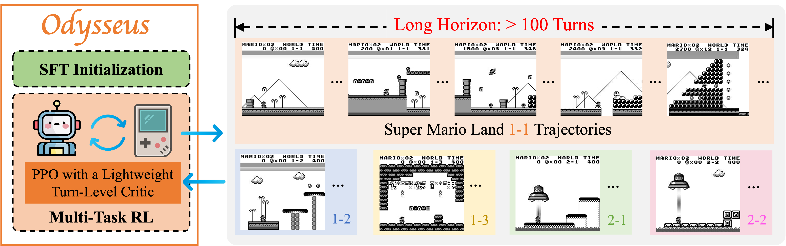
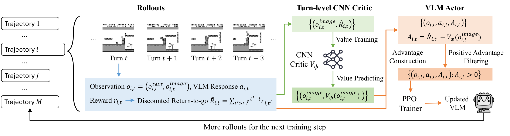

# Odysseus

**Scaling VLMs to 100+ Turn Decision-Making in Games via Reinforcement Learning**

[Project website and demos](https://odysseus-project.github.io/) · [Paper](https://arxiv.org/abs/2605.00347) · [Installation](#installation) · [Training](#training) · [Evaluation](https://github.com/odysseus-project/odysseus-mario-evaluation) · [Citation](#citation)

Odysseus trains vision-language models to play Super Mario Land through reinforcement learning. It combines PPO with a lightweight turn-level CNN critic, positive-advantage filtering, and adaptive sampling across game levels.



This repository provides the **RL training stage**, including seven pipe ablations, five-level training with a trajectory batch size of 1024, built-in validation, and FSDP checkpoint export. The presets initialize from `Qwen/Qwen3-VL-8B-Instruct`; you can supply a different starting checkpoint through `ODYSSEUS_MODEL_PATH`. See the [project website](https://odysseus-project.github.io/) for the full method, results, and gameplay videos.

For evaluation code, see the companion [Odysseus Mario evaluation repository](https://github.com/odysseus-project/odysseus-mario-evaluation).

## Installation

Use Linux x86_64, Python 3.12, and NVIDIA GPUs with a driver compatible with CUDA 12.8. The reference software stack is Torch 2.8.0, vLLM 0.11.0, Transformers 4.57.1, FlashAttention 2.8.3, PyBoy 2.6.0, and NumPy 2.2.6. Pipe presets request four GPUs; the five-level preset requests two nodes with eight GPUs each. GPU memory requirements have not yet been validated for this release.

```bash
git clone https://github.com/odysseus-project/odysseus-mario-training.git
cd odysseus-mario-training
conda create -n odysseus python=3.12 pip -y
conda activate odysseus
bash verl/jobs/install.sh
cd verl
```

The installer uses the pinned [requirements](verl/requirements-odysseus.txt) and [constraints](verl/constraints-odysseus.txt), installs this checkout in editable mode, and runs `pip check`. Its FlashAttention wheel targets CPython 3.12, Linux x86_64, Torch 2.8, CUDA 12, and the CXX11 ABI. Set `ODYSSEUS_FLASH_ATTN_WHEEL` to use an equivalent local wheel.

**Run the remaining commands from the repository's `verl/` directory in the activated environment.**

## Prepare the inputs

### Game assets

Supply your own Super Mario Land ROM and keep it outside the repository:

```bash
export ODYSSEUS_ROM_PATH=/absolute/path/to/super_mario_land.gb
export ODYSSEUS_REPO_ROOT=$(cd .. && pwd)
export ODYSSEUS_DATA_ROOT="$PWD/jobs/dataset"
```

Pipe experiments start from the included [`rom/pipe_gray.state`](rom/pipe_gray.state). To use another starting state, set `ODYSSEUS_PIPE_STATE` to its absolute path. The emulator tests below check ROM/state compatibility.

### Datasets

Generate the pipe and five-level datasets:

```bash
# Pipe ablations: 1024 training rows and 128 validation rows.
python -m jobs.generate_dataset \
  --output_dir "$ODYSSEUS_DATA_ROOT/super_mario_land_markov_1024_train_128_test" \
  --train_size 1024 --test_size 128

# Five-level training: 1024 training rows and 1024 validation rows.
python -m jobs.generate_dataset \
  --output_dir "$ODYSSEUS_DATA_ROOT/super_mario_land_markov_1024_train_1024_test" \
  --train_size 1024 --test_size 1024
```

Each row supplies the game prompt, agent selector, sample index, and metadata for an online rollout. Existing files are protected; add `--overwrite` when regenerating them.

### Starting model

The default model is `Qwen/Qwen3-VL-8B-Instruct`. Set `ODYSSEUS_MODEL_PATH` to another Hugging Face model ID or a local checkpoint directory. For a Hub model, set `ODYSSEUS_MODEL_REVISION` to a commit hash to select a fixed revision.

For offline cluster runs, download the model into a shared cache or directory beforehand. Configure `HF_HOME` and `HF_HUB_OFFLINE` for your environment. Training resolves the model once before startup and records the selected snapshot.

## Training

Inspect a preset and check its inputs before allocating training resources:

```bash
bash jobs/run.sh --config-name pipe_cnn_critic_pos --cfg job --resolve
bash jobs/run.sh --config-name pipe_cnn_critic_pos release.check_only=true
```

Preflight checks paths, dataset contents, and configuration without loading model weights or starting Ray. Use the emulator tests below to check the ROM itself.

Inside a four-GPU allocation, launch a pipe experiment:

```bash
export ODYSSEUS_RUN_NAME=pipe_cnn_critic_pos_run1
bash jobs/run.sh --config-name pipe_cnn_critic_pos
```

Choose a preset from the table below. GPU counts are **nodes × GPUs per node**.

| Preset | Method | Trajectory batch / PPO minibatch | Maximum turns | GPUs |
| --- | --- | --- | --- | --- |
| `pipe_cnn_critic` | PPO with CNN critic | 128 / 512 | 80 | 1 × 4 |
| `pipe_cnn_critic_pos` | PPO with CNN critic + positive advantages | 128 / 512 | 80 | 1 × 4 |
| `pipe_no_critic` | Reinforce++ | 128 / 512 | 80 | 1 × 4 |
| `pipe_grpo_process` | GRPO, process rewards | 128 / 512 | 80 | 1 × 4 |
| `pipe_grpo_process_pos` | GRPO, process rewards + positive advantages | 128 / 512 | 80 | 1 × 4 |
| `pipe_grpo_traj_outcome` | GRPO, outcome rewards | 128 / 512 | 80 | 1 × 4 |
| `pipe_grpo_traj_outcome_pos` | GRPO, outcome rewards + positive advantages | 128 / 512 | 80 | 1 × 4 |
| `train_1024_base` | PPO with CNN critic + positive advantages | 1024 / 4096 | 400 | 2 × 8 |

All presets use FSDP actor training, asynchronous vLLM rollouts, and an actor learning rate of `1e-6`. PPO and Reinforce++ use a discount factor of `0.95`; GRPO uses undiscounted returns. CNN critics use a learning rate of `3e-4`. The [configuration files](verl/jobs/config/) specify the complete settings.



The five-level preset trains on **1-1, 1-2, 1-3, 2-1, and 2-2**, with adaptive level sampling. Built-in validation covers those levels plus **3-1, 3-2, 3-3, 4-1, and 4-2**.

Override settings on the command line as needed. For example, append `trainer.total_training_steps=100` to set a 100-update training budget. Without an explicit step limit, presets use `trainer.total_epochs=500`.

Outputs default to `<repository>/outputs/<run-name>/`. Set `ODYSSEUS_RUN_DIR` to choose a shared output directory. Each run saves its log, rollout and validation records, checkpoints, resolved configurations, source revision, package versions, model snapshot, and input hashes. W&B defaults to offline mode; use `WANDB_MODE=online` or `trainer.logger='[console]'` to change logging.

### Slurm and two-node training

Activate the environment and export the input variables before submission. Adapt account, partition, time, memory, and network settings to your cluster. Both nodes must share the checkout, environment, datasets, model/cache, and output directory.

```bash
# Four-GPU pipe experiment.
sbatch jobs/slurm/pipe_abalation/qwen3_vl_8b_pipe_cnn_critic_pos.slurm

# Five-level training on two nodes, eight GPUs per node.
sbatch jobs/slurm/5_levels_train_10_levels_eval_1024_base.slurm
```

The two-node launcher starts a Ray head and worker, waits for both nodes, and checks available GPU resources before training. `ODYSSEUS_RAY_PORT` defaults to `6379`. Set `ODYSSEUS_RAY_HOST_SUFFIX` if your training network uses a separate hostname suffix; configure `NCCL_SOCKET_IFNAME` and `GLOO_SOCKET_IFNAME` as needed. To use an existing Ray cluster, set `RAY_ADDRESS` and launch `train_1024_base` through `jobs/run.sh`.

## Validation and checkpoint resume

Run the CPU checks, with an optional external ROM for emulator tests:

```bash
python -m unittest discover -s tests/release -v
ODYSSEUS_TEST_ROM="$ODYSSEUS_ROM_PATH" python -m unittest discover -s tests/release -v
```

For a short training run, generate the smoke datasets:

```bash
python -m jobs.generate_dataset \
  --output_dir "$ODYSSEUS_DATA_ROOT/smoke_pipe" --train_size 16 --test_size 8
python -m jobs.generate_dataset \
  --output_dir "$ODYSSEUS_DATA_ROOT/smoke_multi_level" --train_size 32 --test_size 16
```

Smoke overlays run two updates, with validation and checkpointing after each update, 16-turn rollouts, and console logging. They keep the selected algorithm and GPU topology. On a four-GPU node:

```bash
export ODYSSEUS_RUN_DIR="$ODYSSEUS_REPO_ROOT/outputs/smoke_pipe_cnn_pos"
bash jobs/run.sh --config-name pipe_cnn_critic_pos smoke=pipe

# Resume the same run through update 3.
bash jobs/run.sh --config-name pipe_cnn_critic_pos smoke=pipe \
  trainer.resume_mode=auto trainer.total_training_steps=3
```

For the two-node preset:

```bash
export ODYSSEUS_RUN_DIR="$ODYSSEUS_REPO_ROOT/outputs/smoke_multi_level"
sbatch jobs/slurm/5_levels_train_10_levels_eval_1024_base.slurm smoke=multi_level

# Submit after the first job succeeds, keeping the same output directory.
sbatch jobs/slurm/5_levels_train_10_levels_eval_1024_base.slurm \
  smoke=multi_level trainer.resume_mode=auto trainer.total_training_steps=3
```

Check for completed updates, finite actor/critic metrics where applicable, validation outputs, saved checkpoints, and a resumed third update. Use a separate output directory for each experiment and avoid concurrent jobs writing to the same directory.

**Validation status:** configuration, dataset, scripted rollout, and CPU/emulator checks have been exercised. GPU training, two-node execution, checkpoint resume, and export of a trained checkpoint remain unvalidated for this release.

## Export an actor checkpoint

Merge an FSDP actor checkpoint into Hugging Face format:

```bash
python -m verl.model_merger merge --backend fsdp \
  --local_dir /absolute/path/to/run/global_step_2/actor \
  --target_dir /absolute/path/to/exported_actor
```

The export contains the actor model. Resume training from the original run checkpoints, which also contain optimizer and critic state.

## Code structure

| Path | Contents |
| --- | --- |
| [`verl/jobs/`](verl/jobs/) | Experiment presets, dataset generator, launcher, installer, and Slurm examples. |
| [`verl/verl/experimental/agent_loop/game_agent_loop.py`](verl/verl/experimental/agent_loop/game_agent_loop.py) | Multi-turn model/environment interaction. |
| [`verl/verl/utils/game_envs/super_mario_land/`](verl/verl/utils/game_envs/super_mario_land/) | PyBoy environment and game prompt. |
| [`verl/recipe/game_agent/dataset.py`](verl/recipe/game_agent/dataset.py) | Training dataset adapter. |
| [`verl/verl/`](verl/verl/) | Trainer, workers, rollout backends, and checkpoint utilities. |
| [`verl/tests/release/`](verl/tests/release/) | Configuration, dataset, rollout, and emulator checks. |

See the [development guide](verl/CONTRIBUTING.md) for contribution and testing instructions.

## Citation

If you use this code in your research, please cite our paper accepted at [COLM 2026](https://colmweb.org/):

```bibtex
@inproceedings{shi2026odysseus,
  title = {Odysseus: Scaling VLMs to 100+ Turn Decision-Making in Games via Reinforcement Learning},
  author = {Shi, Chengshuai and Li, Wenzhe and Liang, Xinran and Lu, Yizhou and Yang, Wenjia and Feng, Ruirong and Karten, Seth and Yang, Ziran and Ding, Zihan and Sarch, Gabriel and Chen, Danqi and Narasimhan, Karthik and Jin, Chi},
  booktitle = {Conference on Language Modeling (COLM)},
  year = {2026},
  url = {https://arxiv.org/abs/2605.00347}
}
```

## Acknowledgments

Odysseus builds on [VERL](https://github.com/verl-project/verl), [Qwen3-VL](https://github.com/QwenLM/Qwen3-VL), and [PyBoy](https://github.com/Baekalfen/PyBoy). The vendored VERL code includes its [Apache-2.0 license](verl/LICENSE) and [copyright notice](verl/Notice.txt).
